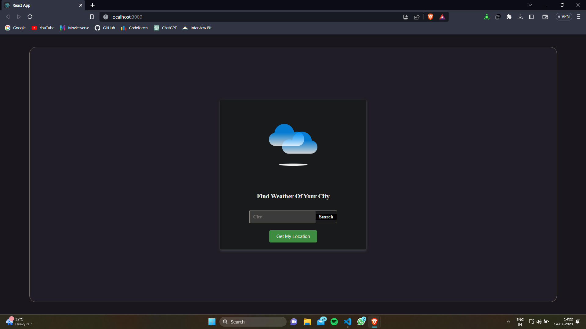
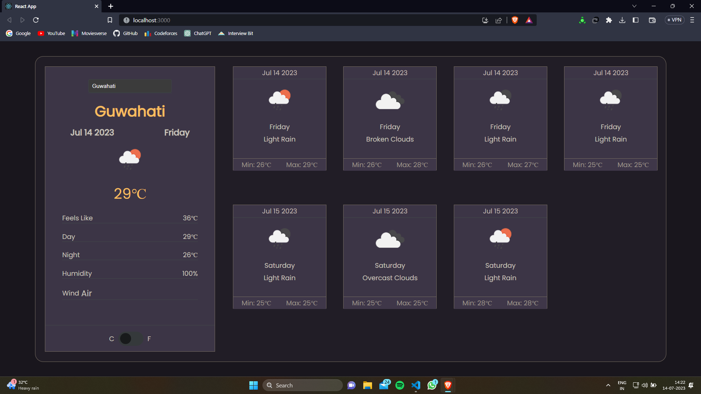

# React Weather Application

## Table of Contents

- [Overview](#overview)
- [Demo](#demo)
- [Screenshots](#screenshots)
- [Features](#features)
- [Installation](#installation)
- [Usage](#usage)
- [Feedback](#feedback)


## Overview

This is a React weather application that allows users to search for weather information for different locations. It provides real-time weather updates, including temperature, humidity, wind speed, and 7-day weather forecast.

## Demo

A link to a live demo of weather app.
(https://anoop7384.github.io/react-weather-application/)

Video Demo -> ((https://youtu.be/_opcQXBW5TA))


## Screenshots

Here are some screenshots of the Weather Website to give you a glimpse of its various pages and features.

## Search Page


## Weather Page


These screenshots provide an overview of the website's design and user interface.

## Features

- Search for weather information by city  with a dynamic search bar providing suggestions as you type.
- Display current weather conditions, including temperature, humidity, wind speed, and description.
- Show a 7-day weather forecast with daily temperature highs and lows.
- Option to switch between metric and imperial units of measurement.
- Retrieve weather information based on the user's current location.
- Responsive design for a seamless experience on different devices.

## Installation

Follow these steps to set up the react app on your local machine:

### Prerequisites

- npm installed on your system.

### 1. Clone the repository
```bash
git clone https://github.com/anoop7384/react-weather-application.git
```


### 2. Install dependencies
```bash
npm install
```

### 4. Start the development server
```bash
npm start
```
The React Weather Application will be accessible locally at http://localhost:3000/.


## Usage

Once the development server is running, you can open a web browser and navigate to http://localhost:3000/ to use the React Weather Application. Enter a city in the search bar to retrieve weather information. The application will provide suggestions as you type, making it easier to find the desired location. 

Additionally, you can click on the location button to fetch weather information based on your current location.


## Feedback
We appreciate your feedback and are dedicated to providing a positive user experience. If you have any suggestions, encounter issues, or need support, please reach out to our support team at anoop553407@gmail.com.


